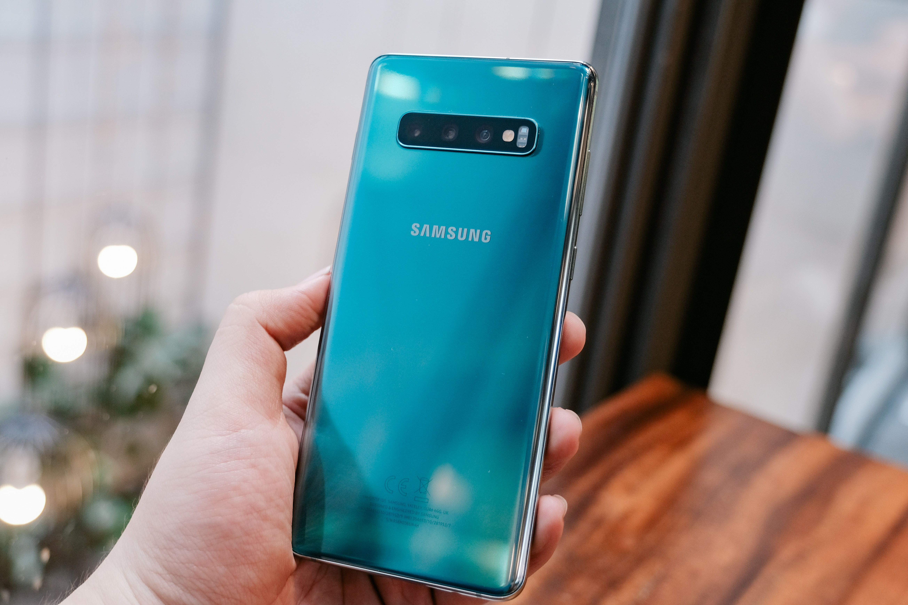
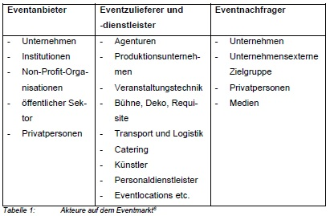
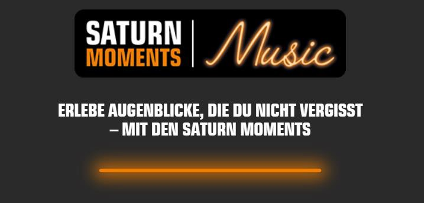
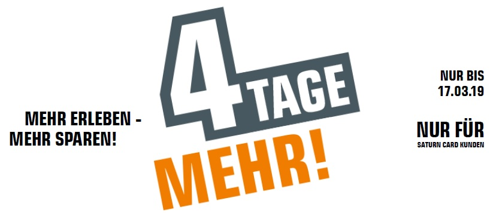
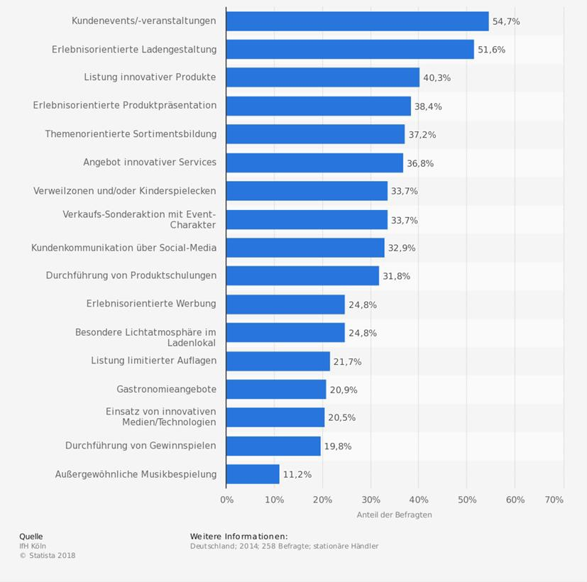

# Neue Strategien

Spätestens seit der Veröffentlichung des Jahresabschlussberichtes Oktober 2018 befindet sich die Media-Saturn Holding in der Krise. Schon vorher senkten immer wieder neue nach unten korrigierte Gewinnprognosen den Aktienwert des Mutterkonzerns Ceconomy AG. Daraufhin verließen viele langjährige Manager das Unternehmen und neue wurden in hohen Positionen eingestellt. Allen voran ist nun Ferran Reverter Planet in der neubesetzten Position des CEOs für die Neuausrichtung des Unternehmens zuständig. Der Spanier, welcher Pieter Haas ersetzt hat, hatte schon die Landesgesellschaft der MediamarktSaturn Retail Group in Spanien wieder auf Kurs gebracht.
Aber was genau ist die Ceconomy AG eigentlich? Ceconomy ist der Mutterkonzern der Elektronikhandelsketten Media Markt und Saturn. Ihr Hauptsitz ist in Düsseldorf. Der Name setzt sich aus Consumer Electronics, Economy und Connectivity zusammen. Der Umsatz des Mutterkonzerns der Handelsketten MediaMarkt und Saturn liegt seit neun Jahren konstant über 20 Milliarden Euro. Der wichtigste Markt für Ceconomy ist Deutschland. Hier betrugen die Umsätze der letzten vier Jahre über zehn Milliarden Euro.
Um entgegen der Unternehmenskrise zu wirken, wurden neue Strategien und Unternehmensstrukturen entwickelt. Wann und wie schnell diese Erneuerungen ins Unternehmen implementiert werden können, ist ein laufender Prozess. CEO Ferran Reverter möchte unter anderem das gesamte Unternehmen mehr zentralisieren und verschlanken – Stichwort Supply Chain Management – , das Sortiment reduzieren, die Themen „Digital Growth“ sowie „Services und Solutions“ stärker fokussieren, mehr Flächen in den Märkten sollen direkt an Hersteller weitervermietet werden – Concessions-Prinzip – und nicht zuletzt möchte man Kunden mit Kursen bzw. Events zum Beispiel über Produktinnovationen in die Märkte locken.
Besonders diese Events sollen in den Märkten von MediaMarkt und Saturn das Einkaufserlebnis der Kunden steigern. Gerade in den Saturn Märkten ist das Thema gezieltes Event-Marketing noch recht neu, da erst mit der Einführung einer Kundenkarte (Saturn Card) im Frühjahr 2017 Kunden gezielt für die Teilnahme an Technikevents angesprochen und eingeladen werden können.
Der Erlebniseinkauf gewinnt heutzutage immer mehr an Bedeutung. Prozentual wächst der Online-Handel im Umsatz in Deutschland stärker als der stationäre Handel. Das bringt viele stationäre Händler in eine schwierige wirtschaftliche Lage, da sie stark der Preistransparenz und somit dem Preisdruck ausgesetzt sind. Vor allem Händler, welche hoch standardisierte Produkte wie beispielsweise Computer, TVs, Smartphones oder anderweitige Elektronikartikel (Consumer Electronics) verkaufen, sind davon betroffen. Da sie aufgrund von möglichen höheren Kosten für Personal oder auch Mieten bei Preiskämpfen nicht unbedingt mithalten können, müssen sie neue Alleinstellungsmerkmale schaffen (USPs). Das heißt, dass dem Kunden neben der Beratung im Markt noch weitere Mehrwerte angeboten werden müssen. Hier wird vom Erlebniseinkauf gesprochen.
Events wie Neu- und Wiedereröffnungen, Jahresstartveranstaltungen oder etablierte Events wie Black Friday wurden in der Vergangenheit schon immer von Saturn organisiert. Allerdings waren sie meist noch nicht zielgruppenfokussiert. Die Werbemaßnahmen waren in ihrer Kommunikation oft aggressiv und massentauglich. Auch die Möglichkeit zur Bildung von Alleinstellungsmerkmalen ergab sich nicht zwingend aus den etablierten Events. Seit der Einführung der Saturn Card als Kundenbindungsprogramm beim Unternehmen Saturn werden zielgruppenfokussierte Technikevents in den Märkten angeboten.

# Eventanbieter Saturn

Der Eventmarkt lässt sich in folgende jeweils beteiligte Akteure in unterschiedlichen Gruppen einteilen:

Das Unternehmen Saturn ist ein Eventanbieter. Eventzulieferer und -dienstleister sind für Saturn in erster Linie Produktionsunternehmen, wie zum Beispiel Miele, Liebherr und Samsung. In zweiter Linie können auch Personaldienstleister im Auftrag der Produktionsunternehmen durch Bereitstellung von Personal für Promotion-Aktivitäten Eventdienstleister sein. Wichtige Eventnachfrager sind in diesem Kontext unternehmensexterne Zielgruppen wie Privatpersonen und auch Unternehmen. Die Privatpersonen bzw. Endverbraucher sind weiterhin die wichtigste Zielgruppe und damit auch der wichtigste Eventnachfrager für das Unternehmen Saturn. Diese Zielgruppe kann genauer als technikinteressiert beschrieben werden. Allerdings muss diese Zielgruppe nicht nur rein technikinteressiert sein, sondern kann auch einfach eine gewisse Abhängigkeit zu den technischen Geräten haben. Ein Beispiel hierfür ist, dass eine Person seine Wäsche nicht ohne Waschmaschine schnell und gründlich waschen kann. Oder auch die Tatsache, dass die Menschen, vor allem in Industrienationen, ohne ein Smartphone weder ihren Tagesablauf gut organisieren noch mit anderen Menschen über Social Media kommunizieren können.

# Events

Es gibt verschiedene Typen von Events. In der Literatur werden unterschiedliche Kriterien zur Typologisierungen von Events getroffen. Eine geeignete Typologisierung ist die folgende Betrachtung: ist ein Event eher arbeitsorientiert oder freizeitorientiert ist? Arbeitsorientiert heißt, dass ein Event in erster Linie dem Unternehmenszweck entspricht. Im Beispiel von Saturn ist dies der Verkauf von Consumer Electronics. Ist ein Event freizeitorientiert, so dient es in erster Linie dem Markenerlebnis eines Unternehmens. An dieser Stelle ist das Unternehmen Red Bull ein geeignetes Beispiel. Events von Red Bull haben eine hohe Freizeitorientierung, da es sich bei den Events meist um Veranstaltungen handelt, wo Extremsport stattfindet. Der Erlebnisfaktor ist dabei für die Eventteilnehmer sehr hoch.

## Saturn Moments

Das Event „Saturn Moments“ ist bei Saturn ein Event mit hoher Freizeitorientierung. Saturn Moments veranstaltet für Saturn Card-Kunden in regelmäßigen zeitlichen Abständen Events. Bei diesen werden Treffen zwischen Kunden und Prominenten aus der Musik- oder Sportbranche organisiert.

## Produktpräsentationen

Events, welche arbeitsorientiert sind, sind bei Saturn zum Beispiel Produktpräsentationen oder Produktneueinführungen. Zum Beispiel wurde im Saturn Mönckebergstraße, dem größten Elektrofachmarkt in Europa, im Jahr 2018 zum Release des Football-Spiels „NFL Madden 2019“ eine Autogrammstunde mit dem in der Szene bekannten Footballexperten Patrick Esume veranstaltet. Nachweislich konnten die Absatzzahlen durch dieses Event stark gefördert werden und das Event war ein Erfolg.

## Saturn Card Days

Die Saturn Card Days wurden exklusiv für alle Kunden mit einer Saturn Card veranstaltet. Im März 2019 fanden an vier Tagen die Saturn Card Days in den stationären Saturn-Märkten in Deutschland statt. Unter dem Motto „4 Tage mehr – mehr erleben – mehr sparen!“ begrüßte Saturn ganz besonders Saturn Card-Neukunden. Neue Saturn Card-Inhaber hatten vier Tage lang die Chance besondere Angebote zu nutzen, indem sie jeweils 5%, 10% und 15% Rabatt auf je ein Produkt aus verschiedenen Produktkategorien erhielten
Saturn-Mitarbeiter boten neben ihren Produktberatungen den Kunden auch Torte, Amerikaner, Getränke u.v.m. an. Dekorationen wie zum Beispiel 200 Luftballons und viele Blumen wurden in den Elektrofachmärkten platziert. Das Zubereiten von Popcorn und frischen Waffeln sollte vor allem Kinder erfreuen. Die Dekoration und der Duft von Kaffee und Waffeln schuf eine bisher nicht bekannte Erfahrung für die Kunden.
Mit den Saturn Card Days versuchte Saturn die erfolgreiche Konzeption eines Events, was sowohl freizeit- als auch arbeitsorientiert ist.

# Einkaufserlebnis

Die Interaktion des Kunden mit einem Unternehmen bringt Erlebnisse hervor. Diese Erlebnisse – auch Customer Experience genannt – ist von zentraler Bedeutung in einem Markt, welcher durch starken Wettbewerb und substituierbare Produkte und Dienstleistungen geprägt ist. Dadurch, dass die Erlebnisorientierung der Gesellschaft weiterhin zunimmt und sich diese auf das Konsumentenverhalten auswirkt, haben Unternehmen aus dem Online- und Offline-Handel den Trend des Erlebnis-Shoppings erkannt. Entsprechende Konzepte dieser Unternehmen sollen dem Kunden ein positives Einkaufserlebnis vermitteln.

Doch kann man durch Event-Marketing letztendlich überhaupt das Einkaufserlebnis für den Kunden steigern? Laut der obigen Darstellung mögen im deutschen Einzelhandel Events als wichtigstes Instrument der Erlebnissteigerung für Kunden gesehen werden. Unter den Top 10 der Konzeptionen zur Erlebnissteigerung sind gleich drei Konzeptionen mit Eventcharakter: Kundenevents/-veranstaltungen, Erlebnisorientierte Produktpräsentation und Verkaufs-Sonderaktion mit Eventcharakter. Ausgehend von der Darstellung ist es auch wichtig zu verstehen, dass Marketing-Events allein das Einkaufserlebnis nicht steigern können. Was ist ein Event im Elektrofachmarkt wie Saturn ohne eine ordentliche Beratungsqualität oder mit einer Ladengestaltung, welchen den Kunden verschreckt und nicht anspricht. Letztendlich steigern nur die Synergieeffekte all dieser Konzeptionen das Einkaufserlebnis des Kunden. Dennoch können sich Unternehmen durch die Veranstaltung von Events am besten vom Wettbewerb unterscheiden und Alleinstellungsmerkmale schaffen.

# Fazit

Marketingevents sind in der Regel erlebnisorientiert. Events bei Saturn oder in der Elektrofachmarktbranche interagieren immer oft mit den erlebnisorientierten und preispolitischen Ansätzen. Der Grund dafür ist, dass Events mit hoher Erlebnisorientierung höhere Einkaufsfreude für den Kunden bieten, aber nicht zwingend das Tagesgeschäft stärkt und dessen Umsätze steigert. Andersherum ist dies schon eher der Fall. Rein preisorientierte Events, wie zum Beispiel der Black Friday, an dessen Tag im gesamten deutschen Einzelhandel hohe Rabatte ausgegeben werden, steigern die Umsätze der Unternehmen stark. Allerdings haben diese Art von Events auch Nachteile. Sie müssen umgesetzt werden, weil ansonsten ein Unternehmen an Umsatz verliert und der Wettbewerb, welcher diese etablierten Jahresevents auf jeden Fall ausrichtet, den verlorenen Umsatz ansonsten zusätzlich erwirtschaftet. Es besteht also ein sogenannter „Gruppenzwang“. Allerdings erwirken wiederrum rein preispolitisch-orientierte Events keine Kundenbindung, da sie keine Alleinstellungsmerkmale aufbauen. Solche Events locken vor allem stark wechselwillige Kunden an, welche gegenüber Unternehmen nicht loyal bzw. treu sind. Oftmals werde diese Kunden als „Schnäppchenjäger“ oder „Smart Shopper“ deklariert.
Um jeweils die Vorteile von erlebnisorientierten und preispolitisch-orientierten Events zu erhalten, muss ein Mittelweg gefunden. Hier gilt es für ein Unternehmen wie Saturn innovativ zu sein. Events, wie zum Beispiel die Saturn Card Days, könnten ein solcher innovative Mittelweg sein.

# Literaturverzeichnis

Aktienkurs Ceconomy (2019) (2019), https://www.google.com/search?q=aktien-kurs+ceconomy&spell=1&sa=X&ved=0ahUKEwjvlM6kyt7iAhUTA2MBHYMn-CawQBQgrKAA&biw=1536&bih=754 (Zugriff: 2019-06-10)
Ceconomy (2016): CECONOMY Geschichte (2016), https://www.ceco-nomy.de/de/unternehmen/geschichte/ (Zugriff: 2019-04-19)
E-Commerce - Umsatz im stationären- vs. Online-Handel in Deutschland 2020 | Prognose (2014) (2014), https://de.statista.com/statistik/daten/stu-die/295622/umfrage/umsatzprognose-im-stationaeren-handel-vs-online-han-del-in-deutschland/ (Zugriff: 2019-06-10)
Ferran Reverter Planet (2019): Brief von Ferran Reverter, Ingolstadt (Zugriff: 2019-06-10)
HDE (2018): Zahlenspiegel 2018, in: Deutscher Handelsverband 2018, https://einzelhandel.de/index.php?option=com_attachments&task=down-load&id=9593 (Zugriff: 2019-06-10)
Jäger, D. (2016): Grundwissen Eventmanagement, Konstanz/München, 2016
Martin Mehringer (2018): MediaSaturn: Florian Gietl wird neuer CEO - manager magazin, https://www.manager-magazin.de/unternehmen/personalien/medi-asaturn-florian-gietl-wird-neuer-ceo-a-1240592.html (Zugriff: 2019-06-10)
MediaMarktSaturn (2018): Mission Agilität: Über 90 Produktteams sind online (2018), https://www.mediamarktsaturn.com/unternehmen (Zugriff: 2019-06-10)
Prof. Dr. Heinrich Holland (2018): Definition: Customer Experience Management (15.02.2018), https://wirtschaftslexikon.gabler.de/definition/customer-experi-ence-management-54478/version-277507 (Zugriff: 2019-05-30)
SATURN Moments (2019): Saturn Moments Music (2019), https://www.sa-turn.de/de/shop/saturn-moments.html (Zugriff: 2019-04-28)
Statista: Tabellen (Zugriff: 2019-06-10)
– (2019): Themenseite: Elektrofachhandel in Deutschland (2019), https://de.sta-tista.com/themen/1646/elektrofachhandel-in-deutschland/ (Zugriff: 2019-06-10)

[Impressum](/impressum)
[Datenschutz](datenschutz)
